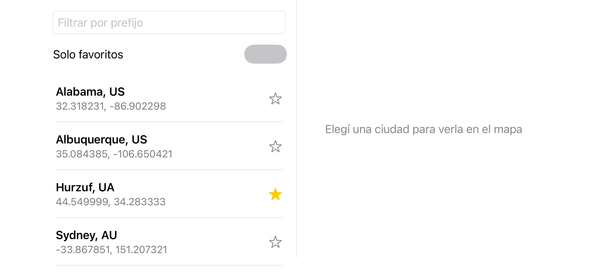

# Ualá Mobile Challenge — iOS

*Juan Francisco Bazan Carrizo — 6 de agosto de 2026*

App iOS que descarga un catálogo de ~200.000 ciudades, las filtra por prefijo actualizando la lista **con cada tecla**, permite marcarlas como favoritas de forma persistente, verlas en un mapa y abrir una ficha de información de cada una — con un layout que cambia según la orientación del dispositivo.

**Stack:** Swift 6 · SwiftUI · MapKit · SwiftData · iOS 26.5 · Xcode 26.6 · **sin librerías de terceros**.

---

## La app de un vistazo

| Portrait — lista y filtro | Landscape — lista y mapa en una sola pantalla |
|---|---|
|  |  |

Las dos capturas **son los PNG que la suite de snapshots compara en cada corrida**, no imágenes sacadas a mano: si la UI cambia y no se regraban, el test falla. Por eso muestran el catálogo de prueba —que usa las ciudades del ejemplo del propio enunciado— y no el gist real.

En la captura de landscape el panel derecho muestra a propósito el estado *"Elegí una ciudad para verla en el mapa"*: los tiles de MapKit llegan por red y de forma asíncrona, así que un snapshot con el mapa dibujado sería inestable por construcción. El comportamiento del mapa está cubierto por tests de UI, no por snapshots.

### Qué hace, punto por punto del enunciado

- **Descarga** el catálogo del gist al arrancar, con estados de carga, error y reintento.
- **Filtra por prefijo** con cada carácter agregado o borrado, sin distinguir mayúsculas de minúsculas.
- **Ordena** los resultados alfabéticamente por ciudad y después por país (`Denver, US` antes que `Sydney, AU`).
- **Filtra solo favoritos**, combinable con el prefijo.
- **Cada celda** muestra `Ciudad, CC` como título y las coordenadas como subtítulo, alterna favorito con la estrella, navega el mapa al tocarla, y abre la ficha de información con el botón ⓘ.
- **Pantalla de información** con datos que no entran en la celda: nombre completo del país, coordenadas en grados/minutos/segundos con hemisferio, identificador y un mapa embebido.
- **Layout adaptativo**: en portrait la lista y el mapa son pantallas separadas; en landscape son dos paneles de una sola pantalla.
- **Los favoritos sobreviven al cierre de la app**, persistidos con SwiftData.
- **Tests unitarios** del algoritmo de búsqueda —incluidos inputs inválidos— y tests unitarios, de snapshot y de UI de cada pantalla implementada.

---

## Enfoque del problema de búsqueda

### El problema

Hay que resolver, **por cada tecla**, un filtro por prefijo case-insensitive sobre 200.000 entradas, devolviendo el resultado ordenado por ciudad y después por país. El enunciado además autoriza explícitamente el trade-off: *"optimizar para búsquedas rápidas; el tiempo de carga de la app no es tan importante"*. O sea que preprocesar sale barato y buscar tiene que salir gratis.

### La representación: un array ordenado, construido una sola vez

Al cargar el catálogo se construye un índice: un array de `CitySearchEntry`, **ordenado**, con una entrada por ciudad.

```swift
struct CitySearchEntry {
    let searchKey: String   // "alabama, us" — "nombre, país" en minúsculas, precalculado
    let cityIndex: Int      // posición de la City real en el array del catálogo
}
```

Dos decisiones dentro de esa struct:

- **`searchKey` se precalcula una sola vez**, al construir el índice. Si el `lowercased()` se hiciera al comparar, se pagaría en cada comparación del sort inicial y en cada comparación de cada búsqueda posterior.
- **La entrada guarda un índice, no la `City`.** Pesa un `String` y un `Int`, así que entran más entradas por línea de caché durante el descenso del binary search. La ciudad se resuelve recién cuando hay que pintarla.

### La búsqueda: dos binary searches que delimitan un rango

Como el array está ordenado, **todas** las ciudades que empiezan con un prefijo dado quedan contiguas. Buscar es encontrar dónde empieza y dónde termina ese bloque:

```swift
let key = prefix.lowercased()
let start = searchIndex.lowerBound { $0.searchKey < key }
let end   = searchIndex.lowerBound { $0.searchKey < key + "\u{10FFFF}" }
return CitySearchResults(cities: cities, entries: searchIndex[start..<end])
```

`lowerBound` devuelve el primer índice donde el predicado deja de cumplirse — el mismo binary search de siempre, ~18 pasos sobre 200.000 elementos (log₂ 200.000 ≈ 17,6).

El truco está en el borde superior. `"\u{10FFFF}"` es el escalar Unicode más alto que existe, así que `"al" + "\u{10FFFF}"` es **mayor** que cualquier string que empiece con `"al"` —después de `"al"`, cualquier carácter real es menor— pero **menor** que cualquier string que se separe de `"al"` antes de terminarlo, como `"anaheim"`, donde la comparación se decide en la `n` y nunca llega a mirar el centinela. Es, literalmente, "el final de todo lo que puede empezar con este prefijo, y nada más".

Con el catálogo del ejemplo del enunciado —`Alabama, Albuquerque, Anaheim, Arizona, Sydney`— y el prefijo `"Al"`, `start` cae en `alabama, us` y `end` en `anaheim, us`, o sea el rango `[0, 2)`: **Alabama y Albuquerque**, que es exactamente lo que el enunciado pide para ese caso.

### El orden alfabético sale gratis

El índice ya está ordenado por `"nombre, país"`, así que el rango resultante sale ordenado por ciudad y después por país sin ordenar nada en cada tecleo. El requisito de orden no cuesta ni una comparación en el camino caliente.

### Los números

Medidos sobre 200.000 ciudades sintéticas, **compilando el mismo código en `-O` (Release)**, en `CityCatalogPerformanceTests`:

| Operación | Tiempo |
|---|---|
| `buildIndex` — una sola vez, al cargar | 12,9 ms |
| `search(prefix:)` — un tecleo | **0,36 µs** |
| `search(prefix:)` + leer las 50 filas visibles | 0,63 µs |
| `search(prefix: "")` — catálogo completo | 0,011 µs |
| `filter(hasPrefix:)` equivalente, para comparar | 3.811 µs |

Unas **10.000 veces más rápido por tecleo** que el filtro lineal, a cambio de 13 ms pagados una única vez al arrancar — el trade-off que el enunciado autoriza.

### Las alternativas descartadas

| Alternativa | Por qué no |
|---|---|
| `filter { $0.hasPrefix(...) }` | O(n) por tecla: recorre las 200.000 entradas para cada carácter que se escribe |
| Trie | Nodos dispersos en el heap; cada paso del recorrido es un salto de puntero con cache miss potencial. Un array es memoria contigua y el CPU prefetchea el bloque siguiente. Para prefix matching exacto —no fuzzy, no autocompletado difuso— el array gana con mucho menos código para mantener y testear, y sin librerías de terceros un trie a mano es todo código propio |
| Guardar la `City` dentro de la entrada del índice | La entrada pesa más y entran menos por línea de caché durante el binary search |
| Calcular `lowercased()` al comparar | Se paga en cada comparación del sort y de cada búsqueda, en vez de una sola vez al indexar |

La justificación formal de la representación vive además en el doc comment de [Cities/CitySearch/CitySearchEntry.swift](Cities/CitySearch/CitySearchEntry.swift), porque el enunciado pide textualmente que esté **en los comentarios del código**. Es la única excepción a la regla de "sin comentarios" del proyecto.

### El cuello de botella real no era la búsqueda

Con el algoritmo ya andando, la UI **seguía trabándose**: escribiendo "Albuquerque" desde el filtro vacío se congelaba en la `A`, y de la segunda letra en adelante iba fluido. El switch "Solo favoritos" sin prefijo tenía el mismo síntoma.

Medir antes de tocar mostró que el dominio no era el problema: en la misma máquina, en Debug, tipear seis caracteres seguidos costaba 0,37 ms en total (~0,06 ms por tecla). El costo estaba en SwiftUI: el ViewModel publicaba el resultado **completo**, y con el filtro vacío eso son 200.000 ciudades entregadas enteras a la `List`. Para actualizarse, SwiftUI resuelve la identidad de la colección vieja y la nueva y calcula el batch update contra el collection view que la respalda — un costo proporcional al tamaño de la colección **anterior**, pagado en el main thread. De ahí la forma exacta del síntoma: `""` → `"A"` es 200.000 → ~5.000 y traba; `"A"` → `"Al"` es ~5.000 → ~700 y no.

Se resolvió con dos cosas:

- **Ventana paginada.** El ViewModel guarda el resultado completo puertas adentro y publica solo una página de 50, que crece cuando aparece la última fila. Ninguna transición paga más que el tamaño de una página.
- **Colecciones perezosas de punta a punta.** `CitySearchResults` envuelve un `ArraySlice` del índice: buscar, acotar y filtrar por favoritos solo mueven bordes, nunca copian ciudades. Y `CityCellViewModels` envuelve esa ventana y arma cada view model de celda **recién cuando SwiftUI la indexa para pintar la fila**. Publicar el estado cuesta lo mismo con 50 entradas que con 200.000, y hay un test que compara las dos ventanas y falla si el costo escala.

**Por qué paginar y no debouncear.** Un debounce no elimina el trabajo, lo demora: la primera tecla seguiría pagando el diff de 200.000, solo que más tarde. Y encima incumpliría el requisito textual de que *"la lista debe actualizarse con cada carácter agregado/eliminado"*.

**Lo que esto no resuelve, y queda declarado:** SwiftUI sigue diffeando la `List` contra la colección publicada anterior, y ese diff sí es proporcional al tamaño de la ventana. Con scroll muy profundo y filtro vacío el costo queda abierto — ver [Qué quedó fuera](#qué-quedó-fuera-y-por-qué).

---

## Decisiones y supuestos

- **El catálogo vive en memoria; SwiftData se usa solo para los favoritos.** El catálogo es reference data inmutable que se descarga entera y nunca se edita: meterla en SwiftData sumaría schema, fetch requests y el overhead de `@Model` sin un solo `UPDATE` que lo justifique. Lo que sí necesita sobrevivir al cierre de la app es el set de IDs favoritos — chico, mutable y con semántica de usuario.

- **La búsqueda corre síncrona en el `MainActor`, sin un `Task` por tecla y sin debounce.** El plan técnico inicial proponía exactamente lo contrario; los números lo cambiaron. Con 0,36 µs por búsqueda, crear y cancelar un `Task` cuesta más que la búsqueda misma, y agrega la posibilidad de que un resultado viejo pise a uno nuevo. La cancelación que sí importa es la de la carga inicial (red + indexado), y esa la maneja el `.task(id:)` de SwiftUI.

- **El mapeo y el indexado corren fuera del hilo de UI.** `CityCatalogLoader.load()` está marcado `@concurrent`, así que parsear ~10 MB de JSON y ordenar 200.000 entradas no congela la pantalla de carga.

- **`verticalSizeClass`, no `horizontalSizeClass` ni `NavigationSplitView`.** En los iPhone que no son Plus/Pro Max el `horizontalSizeClass` es `.compact` en las dos orientaciones, y `NavigationSplitView` reacciona justamente a esa — se quedaría en una sola columna en landscape, que es lo contrario de lo que piden los wireframes. El `verticalSizeClass` sí distingue portrait de landscape en todos los modelos.

- **La UI nunca muestra como guardado algo que no se guardó.** `FavoritesStore` declara sus dos operaciones como `throws`, y el estado en memoria se actualiza **solo después** de que la escritura confirmó. Si la persistencia falla, el toggle es un no-op visible en vez de una estrella prendida sobre un dato perdido.

- **Si SwiftData no puede levantar su container, la app degrada en vez de crashear**: arranca con favoritos en memoria, que se pierden al cerrar. Un problema de persistencia no debería impedir usar la app.

- **Errores tipados en el borde del dominio.** `CityCatalogLoader` declara `throws(CityCatalogLoadError)` con tres casos exhaustivos, así que el ViewModel hace `switch` sin `default`: un cuarto caso obligaría al compilador a pedir una decisión. La cancelación es uno de esos casos y **no se muestra como error** — un task cancelado es la app rotando o navegando, no una falla que el usuario deba ver.

- **`Locale` se inyecta por initializer, sin protocolo de por medio.** El nombre completo del país sale de `locale.localizedString(forRegionCode:)`. `Locale` es un value type de Foundation sin I/O —la misma categoría que `Data` o `URL`, que el dominio ya usa—, así que no le aplica la regla de "framework detrás de un protocolo" que sí gobierna a MapKit, SwiftData y URLSession. Un `CountryNameResolver` con su implementación y su doble de test sería envolver una función pura en tres tipos.

- **La cota superior del rango de prefijo es `\u{10FFFF}`, el máximo real de Unicode.** El plan técnico había propuesto `\u{FFFF}`, que alcanza para nombres en el Basic Multilingual Plane; se eligió la cota que no depende de ninguna asunción sobre el contenido del catálogo.

- **Supuestos sobre el gist:** cada entrada trae `_id`, `name`, `country` y `coord` con `lat`/`lon`, y esos nombres se traducen a los del dominio en el borde de red, así que el formato del JSON no se filtra hacia adentro. **Una sola entrada inválida invalida el catálogo entero**: es preferible un error explícito a un catálogo parcial presentado como completo.

- **El código de país se muestra tal cual si el `Locale` no lo reconoce**, en vez de dejar el campo vacío o inventar un nombre.

- **Cero librerías de terceros**, como pide el enunciado — incluida la infraestructura de snapshot testing, que es propia (166 líneas en dos archivos) en vez de la librería habitual.

- **El deployment target es iOS 26.5, la versión más nueva estable.** Es una decisión consciente y no un default sin mirar: fija el piso en la última versión y excluye dispositivos anteriores, lo cual es aceptable para un challenge que se evalúa en simulador con el SDK más nuevo. `SWIFT_VERSION = 6.0` es el language mode más reciente que existe.

---

## Qué quedó fuera, y por qué

Todo lo que sigue está identificado, argumentado y registrado — no son huecos encontrados después:

- **Catálogo offline con cache en disco.** Está escrita como Historia 11 en [docs/USE-CASES.md](docs/USE-CASES.md), con sus escenarios y su contrato, y **explícitamente diferida**: el enunciado no la pide en ningún punto, y aclara que el tiempo de carga no es prioritario, que es justo el argumento principal a favor de cachear. Hoy, sin conexión y sin una carga previa, la pantalla queda en el estado de error con "Reintentar".

- **Una fuente de datos adicional en la pantalla de detalle.** El enunciado la permite (*"puede incluir datos de una fuente adicional"*) pero no la exige. Sumarla implica otro loader, sus estados de carga y error, y una dependencia externa que puede caerse, para una pantalla que ya cumple el requisito con datos derivados localmente.

- **El diff de la `List` con scroll muy profundo.** La paginación acota el costo pero no lo elimina; está medido, documentado y con el siguiente paso anotado (reciclado de páginas con un techo para la ventana).

- **Marcar un favorito hace un fetch sin índice más un commit SQLite síncrono en el `MainActor`.** Se paga con un `@Attribute(.unique)` sobre `FavoriteCity.cityID`, que arrastra un cambio de schema; quedó anotado y diferido a propósito.

- **`CityListViewModel.isFavorite(_:)` es API pública sin llamador en producción** desde que el estado de favorito viaja adentro de la celda publicada. Hoy la sostienen solo sus tests; es candidata a borrarse.

El detalle de cada uno está en la tabla de observaciones de [docs/ARQUITECTURA.md](docs/ARQUITECTURA.md) y en [docs/BITACORA.md](docs/BITACORA.md).

---

## Estructura del proyecto

Un único proyecto Xcode (`ChallengeUALA.xcodeproj`, en la raíz) con tres targets de producción:

| Target | Tipo | Responsabilidad |
|---|---|---|
| `Cities` | Framework (macOS + iOS) | Dominio, índice de búsqueda, red, persistencia de favoritos y view models observables. **Sin SwiftUI.** Es multiplataforma para poder correr el loop de TDD en macOS sin bootear el simulador |
| `CitiesiOS` | Framework (iOS) | Solo vistas SwiftUI, que observan los view models de `Cities`. Separado de la app para que sus tests corran sin lanzarla |
| `ChallengeUALA` | App (iOS) | Composition Root — el único lugar del proyecto que instancia dependencias concretas |

Más cuatro targets de test: `CitiesTests`, `CitiesiOSTests`, `ChallengeUALATests` y `ChallengeUALAUITests`.

Dentro de `Cities`, los archivos se agrupan por boundary —y `CitiesTests` espeja la misma estructura—, con cada framework externo encapsulado en su propia carpeta de infraestructura:

```
Cities/
├── CityFeature/                 City, CityCatalogLoader, LocalCityCatalogLoader
├── CitySearch/                  CityCatalog, CitySearchEntry, CitySearchResults, lowerBound
├── CityAPI/                     CityCatalogMapper, HTTPClient, RemoteCityCatalogLoader
├── CityAPIInfrastructure/       URLSessionHTTPClient                    → URLSession
├── CityFavorites/               FavoritesStore, InMemoryFavoritesStore
├── CityFavoritesInfrastructure/ FavoriteCity, SwiftDataFavoritesStore   → SwiftData
└── CityPresentation/            View models de lista, celda, mapa y detalle
```

La regla que sostiene todo esto: **las dependencias apuntan siempre hacia adentro**. SwiftUI, MapKit, URLSession y SwiftData viven en los bordes, detrás de un protocolo que define el dominio, y ningún módulo instancia componentes de otro — la capa de vistas manda un `Int` y recibe un view model ya armado, así que `CitiesiOS` no construye ni un solo tipo de `Cities`.

> **Para el detalle**: [docs/ARQUITECTURA.md](docs/ARQUITECTURA.md) tiene los diagramas de capas y de clases, el grafo de composición, los siete flujos principales paso a paso y la tabla de qué capa puede conocer qué. Este README los nombra; ese documento los explica.

---

## Cómo correr la app y los tests

Requiere **Xcode 26.6** y, para los targets de iOS, un simulador de **iPhone 17 Pro**.

Desde Xcode: elegir el scheme y `⌘U`. `Cities` corre en "My Mac" (sin simulador, es el loop rápido de TDD); `CitiesiOS` y `ChallengeUALA` necesitan el simulador. Con el scheme `Cities` activo el editor marca `No such module` en los archivos iOS-only: es el comportamiento esperado de un proyecto multiplataforma —esos targets no se construyen para ese destino— y se resuelve cambiando de scheme.

Desde línea de comandos, los mismos dos comandos que corre el CI en cada push y pull request contra `master` ([.github/workflows/CI.yml](.github/workflows/CI.yml)):

```bash
# Núcleo de dominio, en macOS, sin simulador
xcodebuild test -project ChallengeUALA.xcodeproj -scheme Cities \
  -destination 'platform=macOS' -testPlan Cities

# Los 4 targets de iOS juntos, en el simulador
xcodebuild test -project ChallengeUALA.xcodeproj -scheme CI_iOS \
  -destination 'platform=iOS Simulator,name=iPhone 17 Pro' -testPlan CI_iOS
```

### Estrategia de testing

- **Test primero, siempre.** Rojo → verde → refactor, y ningún checkbox de [docs/USE-CASES.md](docs/USE-CASES.md) se tilda sin su test pasando.
- **`CitiesTests`** cubre el dominio por su interfaz pública: búsqueda (incluidos whitespace, símbolos, acentos y strings largos), mapeo del JSON, capa de red, persistencia de favoritos, view models y dos tests de performance que vigilan que el costo no escale.
- **`CitiesiOSTests`** son snapshots de portrait y landscape, con infraestructura propia.
- **`ChallengeUALATests`** ejercita el Composition Root, incluido el camino de persistencia real que arma la app.
- **`ChallengeUALAUITests`** cubre los flujos de punta a punta con el catálogo **inyectado por variable de entorno** (`CITY_CATALOG_JSON`): el Composition Root arma un loader local en vez del remoto, así que los tests corren deterministas, sin red y sin mockear a nivel de framework.
- **Los tests de UI se verifican por mutación.** Un test que no puede fallar es peor que no tenerlo: antes de dar por cubierto un comportamiento se rompe a propósito el código que lo produce y se confirma que el test se pone rojo. Los casos donde eso reveló un test que pasaba en falso están registrados en la bitácora.

---

## Documentación de proceso

| Documento | Qué hay adentro |
|---|---|
| [docs/REQUISITOS.md](docs/REQUISITOS.md) | El enunciado del challenge, traducido. El PDF original está en la misma carpeta |
| [docs/ARQUITECTURA.md](docs/ARQUITECTURA.md) | Diagramas de capas y clases, composición, flujos y decisiones de diseño vigentes |
| [docs/USE-CASES.md](docs/USE-CASES.md) | Las 12 historias con sus escenarios, contrato y checklist. Cada una se escribió **antes** de su código |
| [docs/BITACORA.md](docs/BITACORA.md) | Registro por MR de qué se construyó, qué se descartó y por qué |
| [docs/PLAN-TECNICO.md](docs/PLAN-TECNICO.md) | El plan de ataque inicial, previo al código. Algunas de sus decisiones fueron revisadas por mediciones posteriores; donde eso pasó, manda este README |

El método, en tres líneas: ninguna línea de producción se escribe antes de que su use case esté redactado; cada MR se entrega partido en commits chicos, cada uno dejando el proyecto compilando y la suite entera en verde; y toda decisión no obvia —sobre todo lo que se descartó— queda registrada en la bitácora en el momento en que se toma, no reconstruida al final.
