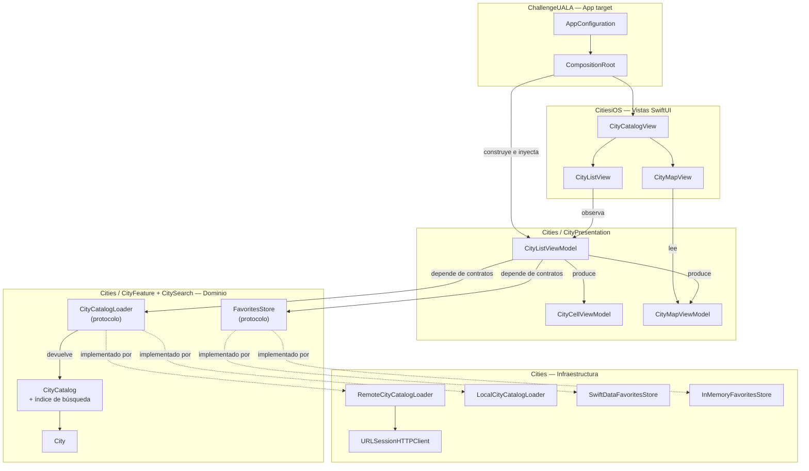
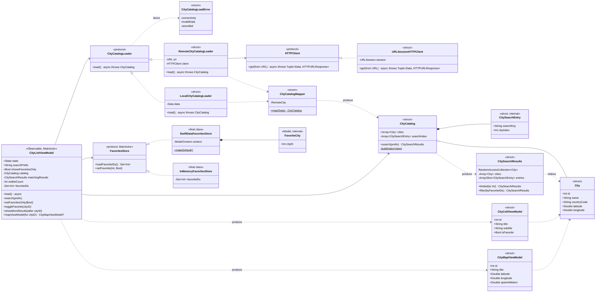
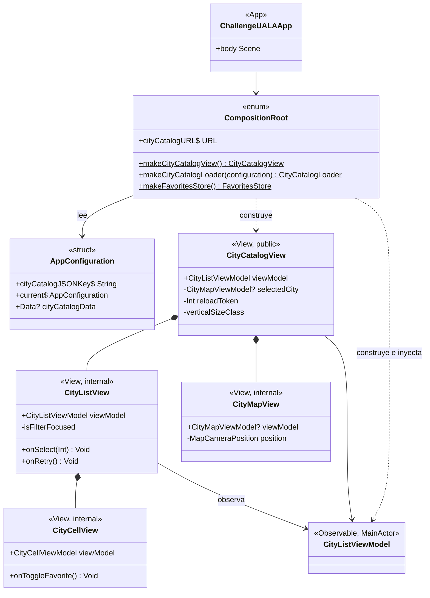
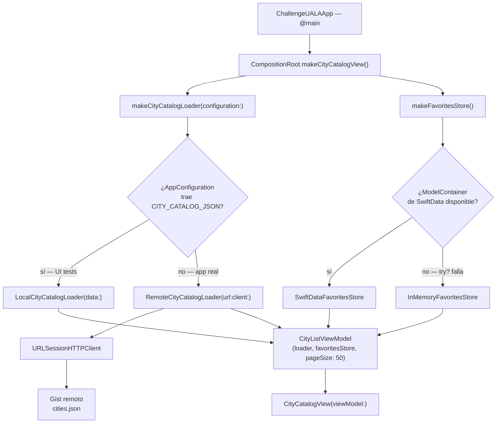
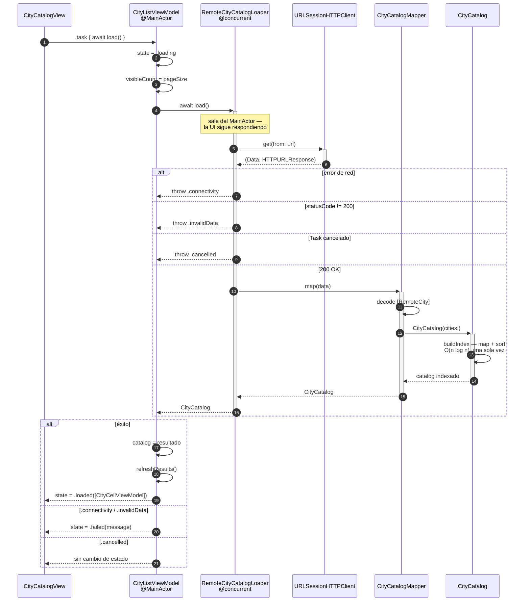
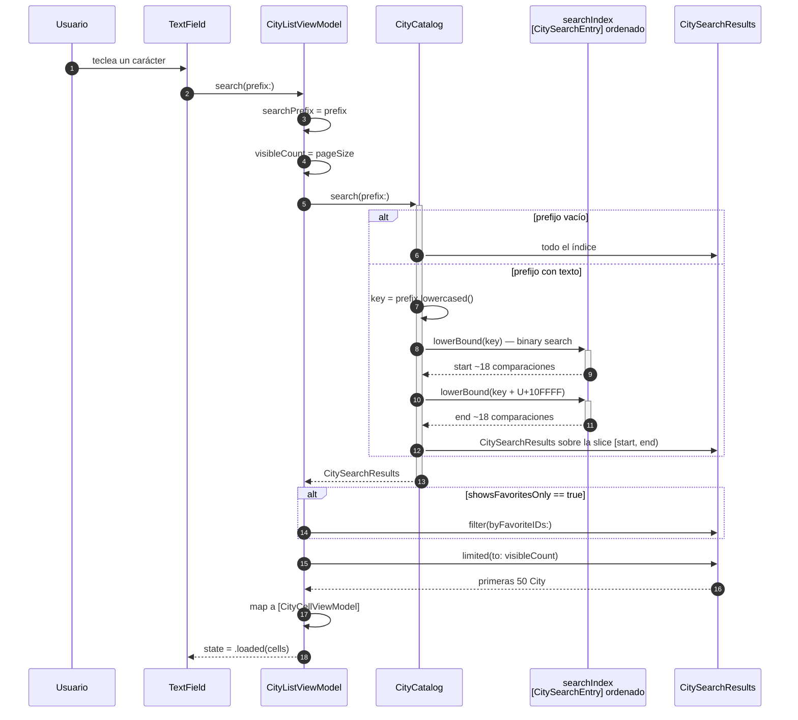
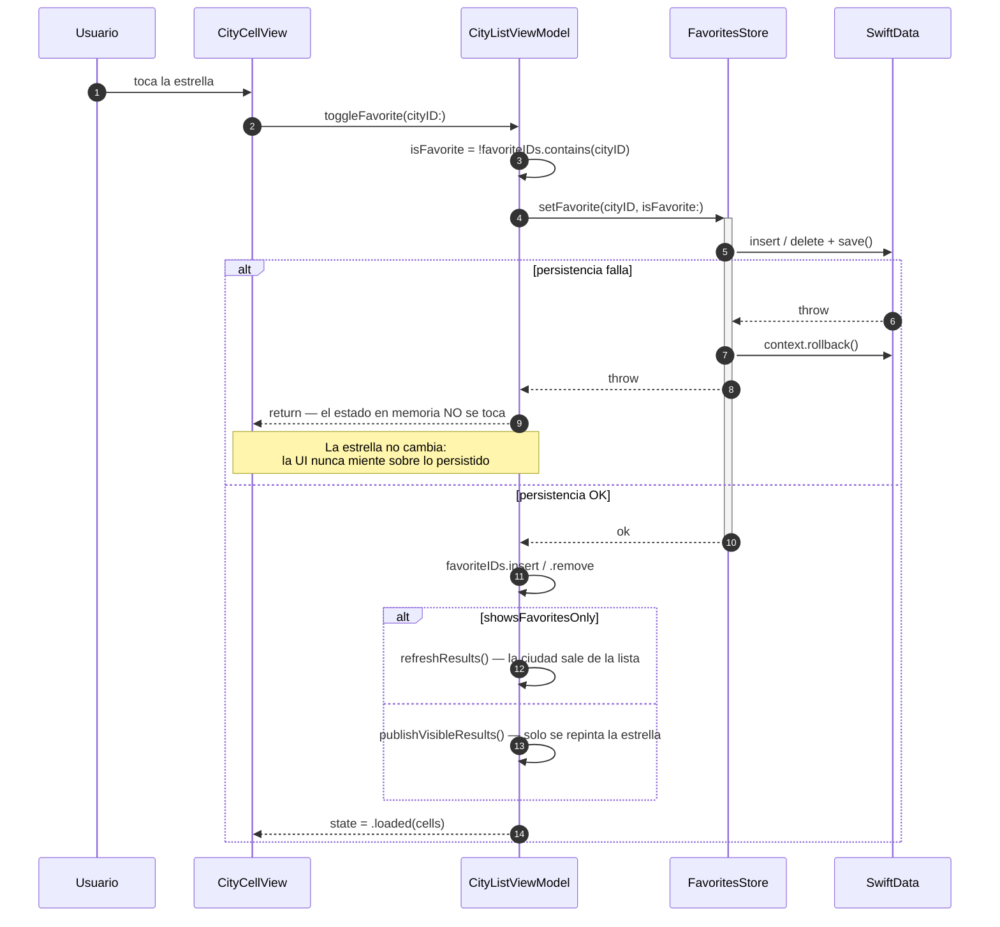
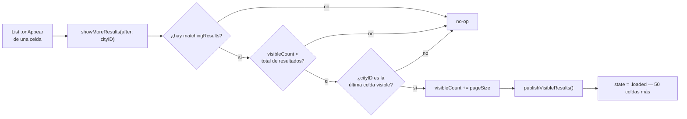
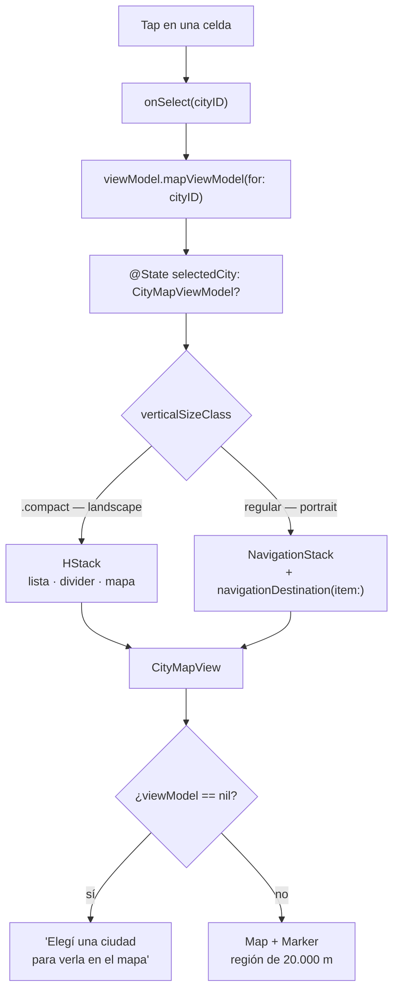
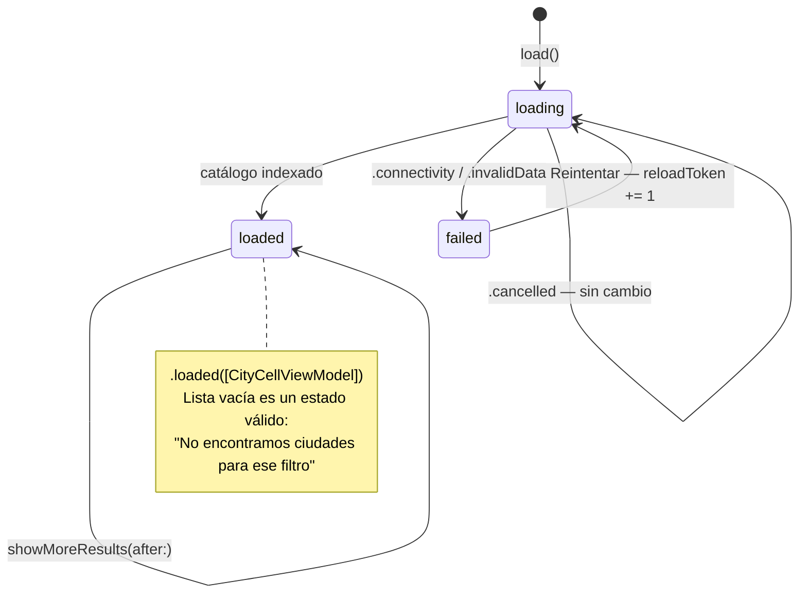

# Arquitectura — Ualá Mobile Challenge

*Juan Francisco Bazan Carrizo — 11 de agosto de 2026*

> Documento vivo. Describe **solo lo que está implementado** en el código a la fecha. Está pensado para migrarse (total o parcialmente) al [README](../README.md) en el MR final, y para servir de base al pasar los diagramas a draw.io.

## Índice

1. [Contexto y objetivo](#contexto-y-objetivo)
2. [Arquitectura general](#arquitectura-general)
3. [Módulos y targets](#módulos-y-targets)
4. [Diagrama de clases](#diagrama-de-clases)
5. [Composición y wiring](#composición-y-wiring)
6. [Flujos principales](#flujos-principales)
7. [Decisiones de diseño vigentes](#decisiones-de-diseño-vigentes)
8. [Observaciones y deuda técnica](#observaciones-y-deuda-técnica)
9. [Glosario](#glosario)

---

## Contexto y objetivo

App iOS (SwiftUI + MapKit + SwiftData) que descarga un catálogo de ~200.000 ciudades, permite **filtrarlas por prefijo con cada tecla**, **marcarlas como favoritas**, y **verlas en un mapa** con un layout que cambia según la orientación del dispositivo.

La restricción dominante del enunciado es de performance de búsqueda: *"optimizar para búsquedas rápidas; el tiempo de carga de la app no es tan importante"*. Toda la arquitectura del motor de búsqueda sale de ahí — ver [Decisiones de diseño](#decisiones-de-diseño-vigentes).

Características del sistema tal como está hoy:

- **Catálogo en memoria, no persistido.** Se descarga una vez por sesión y se indexa. SwiftData se usa **solo** para el set de IDs favoritos.
- **Sin librerías de terceros.** Lo prohíbe el enunciado — incluida la infraestructura de snapshot testing, que es propia.
- **Dependencias siempre hacia adentro.** SwiftUI, MapKit, URLSession y SwiftData viven en los bordes, detrás de un protocolo que define el dominio.

---

## Arquitectura general

### Capas

La flecha clave: **el ViewModel no conoce ninguna implementación concreta**. No sabe si el catálogo viene de la red o de un `Data` local, ni si los favoritos se guardan en SwiftData o en memoria. Esa elección la toma el `CompositionRoot`, una sola vez, en el app target.

### Regla de dependencias

| Capa | Puede conocer | Nunca conoce |
|---|---|---|
| `CityFeature` / `CitySearch` (dominio) | Nada externo (solo Swift stdlib) | URLSession, SwiftData, SwiftUI, MapKit |
| `CityAPI` | El dominio | SwiftUI, SwiftData |
| `CityAPIInfrastructure` | `HTTPClient` (contrato de `CityAPI`) | El ViewModel |
| `CityFavoritesInfrastructure` | `FavoritesStore` (contrato del dominio) | El ViewModel |
| `CityPresentation` | Los protocolos del dominio | Toda implementación concreta y SwiftUI |
| `CitiesiOS` | Los view models de `Cities` | Loaders, stores, URLSession |
| `ChallengeUALA` | **Todo** — es el único que cablea | — |

---

## Módulos y targets

Un solo proyecto Xcode con tres targets de producción y cuatro de test.

| Target | Tipo | Plataforma | Responsabilidad |
|---|---|---|---|
| `Cities` | Framework | macOS + iOS | Dominio, búsqueda, red, persistencia de favoritos y view models. Sin SwiftUI. Multiplataforma para correr el loop de TDD en macOS sin bootear el simulador. |
| `CitiesiOS` | Framework | iOS | Solo vistas SwiftUI. Observan los view models de `Cities`. |
| `ChallengeUALA` | App | iOS | Composition Root. El único lugar que instancia dependencias concretas. |

Dentro de `Cities`, los archivos se agrupan por boundary — y `CitiesTests` espeja la estructura exacta:

| Carpeta | Contenido | Framework que encapsula |
|---|---|---|
| `CityFeature/` | `City`, `CityCatalogLoader`, `CityCatalogLoadError`, `LocalCityCatalogLoader` | — |
| `CitySearch/` | `CityCatalog`, `CitySearchEntry`, `CitySearchResults`, `Array.lowerBound` | — |
| `CityAPI/` | `CityCatalogMapper`, `HTTPClient`, `RemoteCityCatalogLoader` | — |
| `CityAPIInfrastructure/` | `URLSessionHTTPClient` | URLSession |
| `CityFavorites/` | `FavoritesStore`, `InMemoryFavoritesStore` | — |
| `CityFavoritesInfrastructure/` | `FavoriteCity`, `SwiftDataFavoritesStore` | SwiftData |
| `CityPresentation/` | `CityListViewModel`, `CityCellViewModel`, `CityMapViewModel` | — |

`CitiesiOS` encapsula SwiftUI y MapKit; `CityMapView` es el único archivo del proyecto que importa `MapKit`.

---

## Diagrama de clases

### Vista completa

### Capa de vistas

---

## Composición y wiring

Todo el grafo se arma en [CompositionRoot.swift](../ChallengeUALA/CompositionRoot.swift). No hay singletons, no hay estado global mutable, y ningún módulo instancia componentes de otro.

Dos decisiones de wiring visibles en el diagrama:

- **`AppConfiguration` es el switch de testabilidad end-to-end.** Los UI tests inyectan el JSON del catálogo por variable de entorno (`CITY_CATALOG_JSON`), y el Composition Root arma un `LocalCityCatalogLoader` en vez del remoto. Los tests corren determinísticos, sin red y sin mockear a nivel de framework.
- **`makeFavoritesStore()` degrada, no crashea.** Si SwiftData no puede levantar el container, la app arranca con favoritos en memoria: se pierden al cerrar, pero la app funciona. El usuario nunca ve un crash de arranque por un problema de persistencia.

---

## Flujos principales

### 1. Arranque y carga del catálogo

Es el flujo más "grueso" de la app: descarga, parseo e indexado de 200.000 ciudades, todo fuera del `MainActor`.

El punto no obvio: `.cancelled` **no** produce un estado de error. Un Task cancelado no es un fallo que el usuario deba ver — es la app rotando o navegando. Mostrar "no pudimos conectarnos" ahí sería un falso negativo.

### 2. Búsqueda por prefijo — el camino caliente

Se ejecuta con **cada tecla**, sobre 200.000 entradas. Es el criterio de evaluación principal del enunciado.

Tres propiedades que hacen que esto sea barato:

| Paso | Costo | Por qué |
|---|---|---|
| Ubicar el rango | **O(log n)** — ~18 comparaciones | Binary search sobre array ordenado, no scan lineal |
| Construir el resultado | **O(1)** | `CitySearchResults` envuelve un `ArraySlice`; no copia ni reordena nada |
| Materializar celdas | **O(pageSize)** = 50 | `limited(to:)` corta antes de mapear |

El orden alfabético sale gratis: el índice ya está ordenado, así que la slice sale ordenada por ciudad y después por país sin reordenar en cada tecleo.

### 3. Marcar y desmarcar un favorito

La regla: **la memoria se actualiza solo después de que la persistencia confirmó**. Si el store falla, el toggle es un no-op visible — el usuario ve que no pasó nada, en vez de ver una estrella pintada sobre un dato que no se guardó.

### 4. Paginación de la lista

Las tres guardas son un `guard` único en el ViewModel. La lista nunca materializa 200.000 celdas: se renderiza una ventana de 50 que crece al llegar al final. Cualquier cambio de filtro o de favoritos resetea `visibleCount` al tamaño de página.

### 5. Selección de ciudad y layout adaptativo

Detalles que sostienen este flujo:

- **`verticalSizeClass`, no `horizontalSizeClass`.** En iPhone el horizontal es `.compact` en las dos orientaciones; el vertical es el que efectivamente distingue portrait de landscape.
- **El estado de selección es un `CityMapViewModel`, no un `City`.** La vista de mapa recibe un modelo de presentación ya formateado (título armado, span decidido) y no toca el dominio.
- **`CityMapViewModel` no importa MapKit.** `CLLocationCoordinate2D` y `MKCoordinateRegion` se construyen dentro de `CityMapView` — MapKit no cruza el borde hacia `Cities`.

### 6. Estados del ViewModel

El reintento se implementa con un `reloadToken` que invalida el `.task(id:)` de SwiftUI — no con una segunda llamada imperativa. Cambiar el token es lo que hace que SwiftUI cancele el task viejo y arranque uno nuevo.

---

## Decisiones de diseño vigentes

### Array ordenado + binary search en vez de trie o `filter`

La justificación completa vive en el doc comment de [CitySearchEntry.swift](../Cities/CitySearch/CitySearchEntry.swift) — es la única excepción de comentarios del proyecto, porque el enunciado pide textualmente que la justificación de la representación esté **en el código**.

Resumen de las alternativas descartadas:

| Alternativa | Por qué se descartó |
|---|---|
| `filter { $0.hasPrefix(...) }` | O(n) por tecla sobre 200.000 elementos |
| Trie | Nodos dispersos en el heap → cache miss por salto de puntero. Para prefix matching exacto, un array contiguo gana con mucho menos código |
| Guardar la `City` en la entrada | La entrada pesaría más; entran menos por línea de caché durante el descenso del binary search |
| Calcular `lowercased()` al comparar | Se paga en cada comparación del sort y de cada búsqueda. Precalculado, se paga una vez |

### Catálogo en memoria, SwiftData solo para favoritos

El catálogo es inmutable y se descarga entero. Persistirlo agregaría un ciclo de escritura/lectura y una política de invalidación para un dato que no cambia dentro de la sesión. Lo que sí necesita sobrevivir al cierre de la app es el set de favoritos — chico, mutable, y con semántica de usuario.

### El índice se construye fuera del `MainActor`

`CityCatalogLoader.load()` está marcado `@concurrent`, así que el parseo del JSON y el `sort` de 200.000 entradas ocurren en un thread de background. `CityCatalog`, `City` y `CitySearchEntry` son `Sendable` justamente para poder cruzar de vuelta al `@MainActor` bajo strict concurrency de Swift 6.

### `CitySearchResults` como colección perezosa

Es un `RandomAccessCollection` que envuelve un `ArraySlice<CitySearchEntry>` más el array de ciudades. Ni `search(prefix:)`, ni `limited(to:)`, ni `filter(byFavoriteIDs:)` copian ciudades: solo mueven los bordes de la slice. La `City` concreta se resuelve recién en el `subscript`, al pintar una celda.

### Value types por defecto

`City`, `CityCatalog`, `CitySearchResults`, `CityCellViewModel`, `CityMapViewModel`, ambos loaders y el `URLSessionHTTPClient` son `struct`. Las únicas `class` del proyecto son las que necesitan identidad y estado mutable: el `CityListViewModel` (`@Observable`) y los dos `FavoritesStore`.

### Errores tipados en el borde del dominio

`CityCatalogLoader` declara `throws(CityCatalogLoadError)` — tres casos exhaustivos. El ViewModel hace `switch` sin `default`: si mañana aparece un cuarto caso de error, el compilador obliga a decidir qué mensaje mostrar.

---

## Observaciones y deuda técnica

| # | Observación | Impacto |
|---|---|---|
| 1 | `LocalCityCatalogLoader` vive en `CityFeature/` pero usa `CityCatalogMapper`, que vive en `CityAPI/`. Compila porque es el mismo target, pero es un cruce de boundary contra la dirección de las carpetas. Correspondería mover el loader a `CityAPI/`, o extraer el mapper a un boundary propio de decodificación. | Organizacional, no funcional |
| 2 | `CityCatalog` es el tipo de retorno de `CityCatalogLoader` (`CityFeature/`) pero está definido en `CitySearch/`. Es una dependencia legítima del dominio hacia el dominio, pero vale tenerla explícita al leer los diagramas. | Ninguno |
| 3 | Historia 7 (pantalla de información de la ciudad) está redactada en [USE-CASES.md](USE-CASES.md) pero no implementada. | Funcionalidad `could-have` pendiente |
| 4 | Historia 11 (catálogo con fallback offline) está redactada y explícitamente diferida. | Diferida por decisión de scope |
| 5 | El catálogo se recarga entero en cada `load()`. Sin conexión y después de un reintento fallido, no hay snapshot previo para mostrar — es exactamente lo que resolvería la Historia 11. | Aceptado para esta entrega |

---

## Glosario

| Término | Significado en este proyecto |
|---|---|
| **Catálogo** | El conjunto completo de ciudades ya indexado (`CityCatalog`), no la lista cruda |
| **Índice de búsqueda** | `[CitySearchEntry]` ordenado por `searchKey`, construido una vez al cargar |
| **`searchKey`** | `"nombre, país"` en minúsculas, precalculado. Es contra esto que se compara el prefijo |
| **`cityIndex`** | Posición de la `City` real en `CityCatalog.cities`. La entrada del índice no guarda la ciudad |
| **Ventana visible** | Las primeras `visibleCount` ciudades del resultado actual — lo único que se materializa como celdas |
| **Composition Root** | `CompositionRoot` en el app target: el único lugar que instancia dependencias concretas |
| **Boundary** | Un límite arquitectónico marcado por un protocolo. En este repo, también una carpeta dentro de `Cities` |

---

## Documentación relacionada

- [README.md](../README.md) — estructura del proyecto, schemes y cómo correr los tests
- [docs/REQUISITOS.md](REQUISITOS.md) — el enunciado del challenge
- [docs/USE-CASES.md](USE-CASES.md) — historias, escenarios y checklist de cada tarea
- [docs/BITACORA.md](BITACORA.md) — registro de decisiones por MR, incluido lo que se descartó
- [docs/PLAN-TECNICO.md](PLAN-TECNICO.md) — plan técnico inicial
